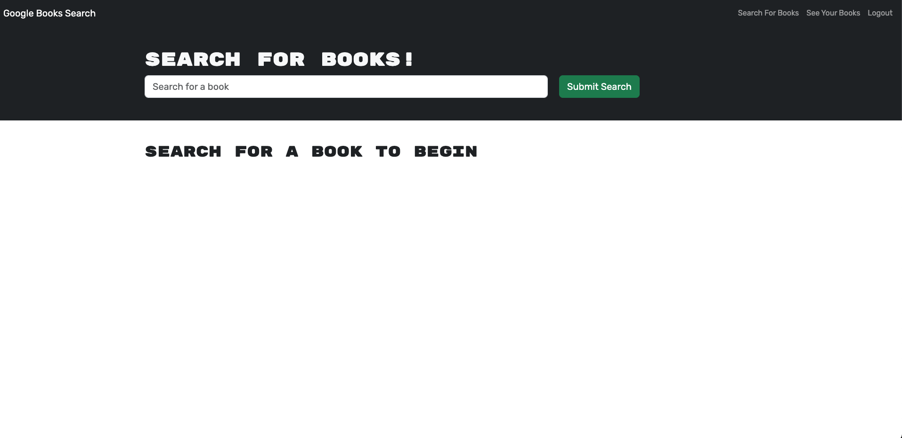
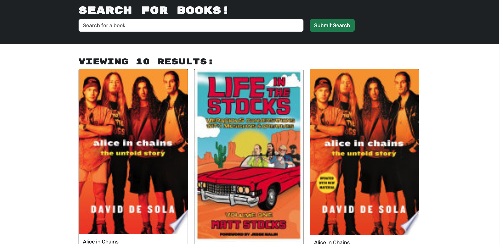
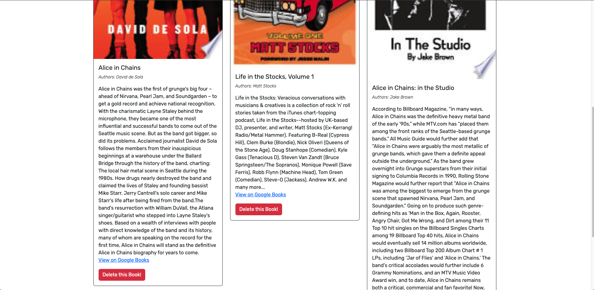

# React Portfolio
 
 

 
  

## Description
This is a MERN stack (MongoDB, Express.js, React.js, Node.js) application that searches Google Books for a given book title, then displays the results. It has a user login function that then provides a method to save desired book titles from the search results to the logged in user's account. The internal database API functions are provided through a GraphQL API using Apollo Server. Security for app is provided by JSON Web Tokens and the jwt-decode module for the client side.


  ## Table of Contents

* [Installation](#installation)
* [Usage](#usage)
* [Screenshots](#screenshots)
* [License](#license)
* [Contributing](#contributing)
* [Contact](#contact)

## Installation
Clone the repository to your local repository.
```
1. Clone or Fork this repo.
1. Open the intergrated terminal.
2. npm install to install all depenpencies.
3. npm run develop to to open the app on local host.
```

## Usage
After cloning and installing it can run in localhost:3000.<br/>
OR<br/>
Direct Link for Render:
```
https://mern-book-search-engine-y2k8.onrender.com/
```


## Screenshots
Here are some of the screenshots of the application.





## License
[](https://opensource.org/licenses/MIT)

## Contributing

There are no guidelines for contributing at this time. Contact me with any ideas or requests if anybody want to contribute.


## Contact
* Email: jujunakarmi@gmail.com
* LinkedIn:[https://www.linkedin.com/in/juju-nakarmi-1a79a7181/](https://www.linkedin.com/in/juju-nakarmi-1a79a7181/)